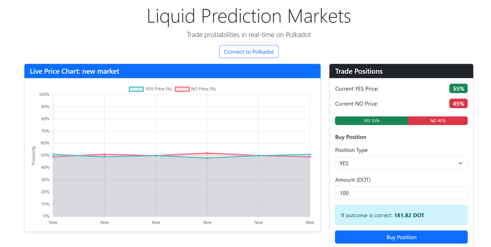
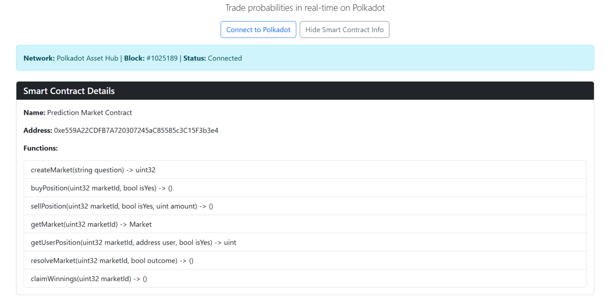
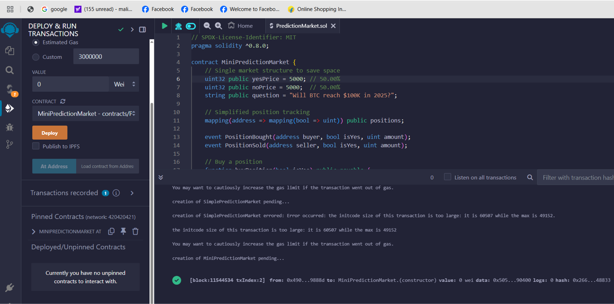
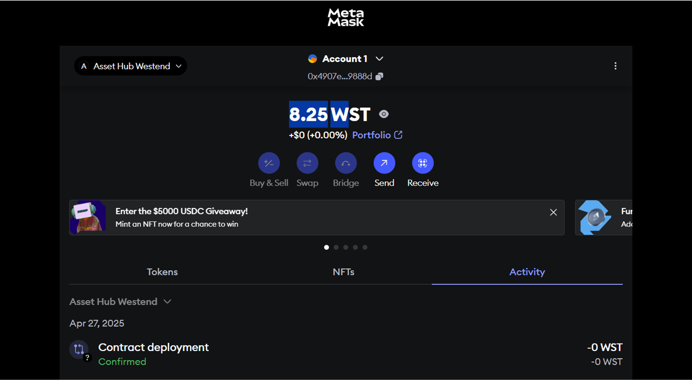
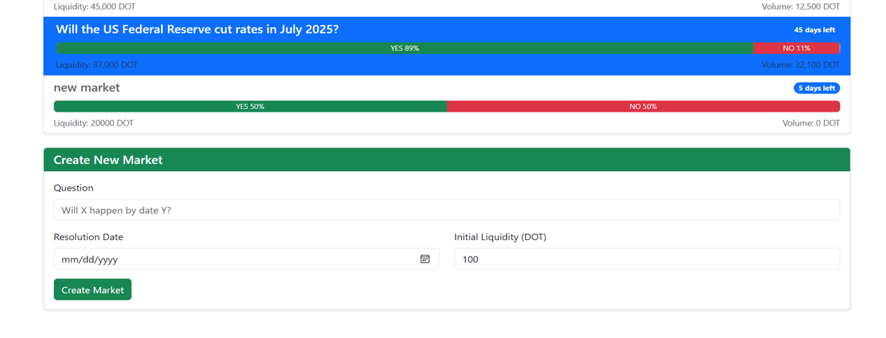
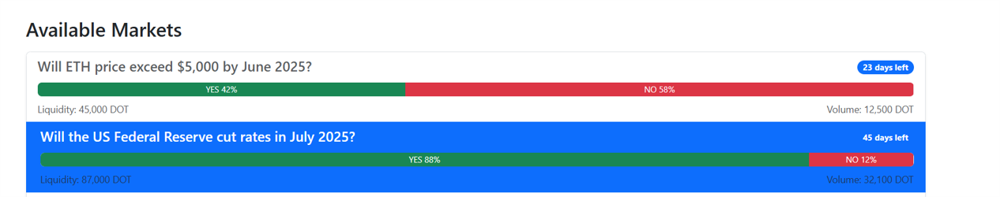
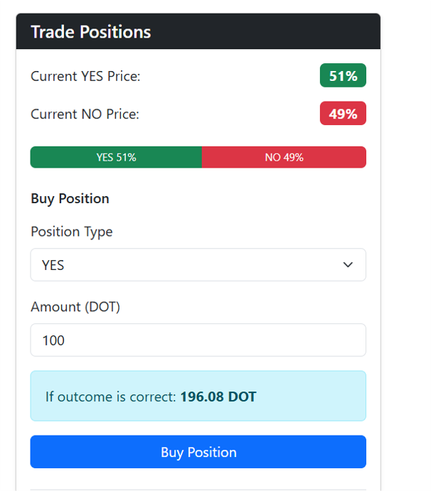
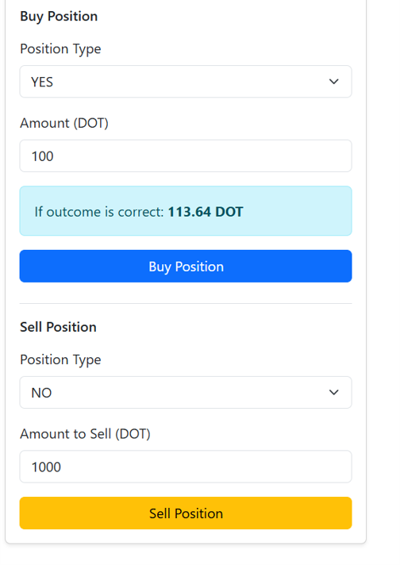
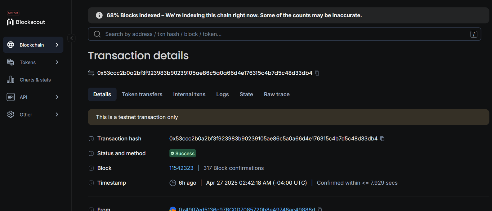
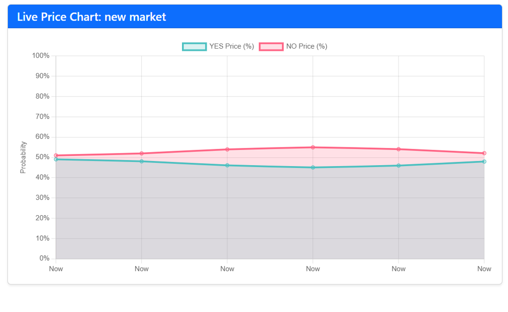

# Liquid-Prediction-Markets

Short Summary 
Liquid Prediction Markets enables real-time trading of probability-based assets on Polkadot, allowing positions to be bought and sold before events resolve.

Full Project Description
Traditional prediction markets suffer from critical limitations that prevent widespread adoption. Once a user makes a prediction, they are locked into their position until the event resolves - sometimes months or years later. This creates illiquid markets where capital is inefficiently allocated, prices don't accurately reflect real-time sentiment, and users have no way to exit positions as new information emerges. Additionally, most platforms only support binary yes/no outcomes, ignoring the nuanced probabilities of real-world events.

Solution
Liquid Prediction Markets transforms predictions into tradable financial instruments with dynamic pricing. Our platform allows users to:

1. Create customizable prediction markets with any question
2. Buy YES/NO positions at prices reflecting current probability estimates
3. Crucially, SELL positions at any time before resolution, unlocking capital and enabling profit-taking when sentiments change
4. Visualize real-time probability curves showing market movements
5. Participate in a more efficient price discovery mechanism

This creates a new financial primitive for risk management and forecasting, with applications across finance, insurance, governance, and sports betting.

How Polkadot Was Used
Polkadot Asset Hub provides the ideal infrastructure for Liquid Prediction Markets:

1. The platform leverages Polkadot's smart contract capabilities to create a secure, decentralized prediction market system
2. Asset Hub's cross-chain functionality enables future integration with external data oracles for market resolution
3. Polkadot's transaction speed and low fees make micro-predictions economically viable
4. The interoperability features will eventually allow markets to span multiple blockchains, increasing liquidity
5. The security of Polkadot's shared consensus model protects market integrity and user funds

Technical Description1. 
1. React.js for the frontend interface and dynamic visualizations
2. Chart.js for real-time probability visualizations
3. Polkadot.js API for blockchain interaction
4. Remix IDE for smart contract development and deployment
5. MetaMask for wallet connectivity and transaction signing
6. Bootstrap for responsive UI components
7. Solidity for smart contract development

Polkadot Features Utilized
Liquid Prediction Markets takes advantage of several unique Polkadot features:

1. Polkadot Asset Hub's EVM compatibility allowed us to deploy Solidity contracts while benefiting from Polkadot's security model
2. The platform leverages Polkadot's efficient consensus mechanism, which has significantly lower environmental impact than proof-of-work chains
3. The multi-chain architecture enables future expansion to specialized parachains for specific market categories
4. Westend testnet provided a realistic environment for development without spending real DOT
5. Asset Hub's ability to handle custom tokens will enable specialized market-specific tokens in future iterations

Images

# I understand that certain clean code practices have not been followed while coding for this project.
# I am an solo coder coding this project due to the time constraints I was not able to follow the best clean coding practices.

